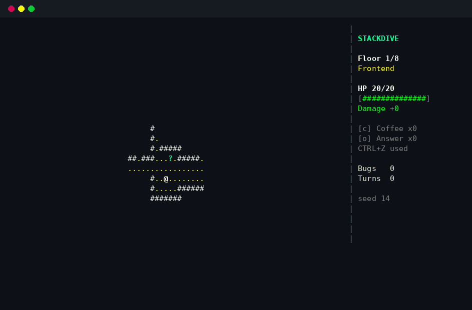

<div align="center">

# stackdive

**A tiny roguelike for your terminal. Dive down the stack and squash the bugs.**

[](https://github.com/vqorn/stackdive/actions/workflows/ci.yml)
[](https://github.com/vqorn/stackdive/releases/latest)
[](LICENSE)




</div>

The build is broken. You are the developer. Eight layers of the stack stand between you and the **Legacy Code**, and every layer is full of bugs: Typos, Null Pointers, Race Conditions, Memory Leaks, Segfaults.

Walk into a bug to hit it. Drink coffee. Paste a Stack Overflow answer without reading it. If you die, you get one line you can paste to your friends.

- 🐛 **Eight layers, eight kinds of bug**, each with its own way to hurt you
- 📅 **`stackdive --daily`**: the same dungeon for everybody today, so you can compare notes
- 🔁 **`stackdive --seed 42`**: play a dungeon again, or send one to a friend
- 🎮 **Short**: one run is one sitting. No save games, no menus, no installer
- 🪟 Linux, macOS and Windows. ASCII only, so it works in every terminal
- 📦 One small binary, written in Rust with a single dependency ([crossterm](https://github.com/crossterm-rs/crossterm))

## Install

Download a binary from [Releases](https://github.com/vqorn/stackdive/releases), unpack it and run it. Or, with a recent [Rust](https://rustup.rs):

```sh
cargo install --git https://github.com/vqorn/stackdive
```

Then:

```sh
stackdive
```

The terminal needs to be at least 64 x 22 characters. On Windows, use Windows Terminal or PowerShell.

## How to play

| Key | |
|---|---|
| arrows, `h` `j` `k` `l`, `w` `a` `s` `d` | move (walk into a bug to hit it) |
| `y` `u` `b` `n` | move diagonally |
| `.` or space | wait a turn |
| `>` | take the stairs (stand on the `>` first) |
| `c` | drink a coffee (+8 HP) |
| `o` | paste a Stack Overflow answer (reveals the floor) |
| `?` | help and legend |
| `q` | quit |

You win by refactoring the Legacy Code on floor 8.

### The bugs

| | Bug | |
|---|---|---|
| `t` | Typo | Weak, but there are many of them. |
| `n` | Null Pointer | Points at nothing and still hurts. |
| `o` | Off-by-one | Hits for 1 or for 3. Never 2. |
| `r` | Race Condition | Fast. Moves twice per turn. |
| `m` | Memory Leak | Heals itself. Do not let it live. |
| `s` | Segfault | Slow, but hits like a truck. |
| `d` | Deadlock | Can freeze you for a turn. |
| `L` | Legacy Code | The boss. Keeps spawning Typos. |

### The loot

| | Item | |
|---|---|---|
| `!` | Coffee | Heals 8 HP when you drink it. |
| `?` | Stack Overflow answer | Reveals the whole floor. |
| `+` | Refactor | +1 damage, for good. |
| `]` | Unit Test | +3 max HP, for good. |
| `z` | CTRL+Z | Undoes one death. There is only one in the whole dungeon. |

## Seeds and the daily dungeon

Every dungeon is made from a seed. The same seed gives the same floors, the same bugs and the same loot on every computer.

```sh
stackdive --daily          # today's dungeon (the date is the seed)
stackdive --seed 42        # a number...
stackdive --seed banana    # ...or any word
stackdive --demo           # watch a bot play
```

What you do on one floor never changes the next one, so two people on the same seed always meet the same bugs in the same rooms. When a run ends, `stackdive` prints a result you can paste:

```
stackdive daily 2026-10-01
Reached floor 5/8 (Database). 31 bugs squashed in 412 turns. Killed by a Segfault (core dumped).
```

## Build from source

```sh
git clone https://github.com/vqorn/stackdive && cd stackdive
cargo run --release
cargo test
```

The game rules know nothing about the terminal, so they are tested on their own: the dungeons are always connected, the bugs never end up inside walls, and a bot plays hundreds of dungeons to make sure that no run can get stuck.

```
src/game.rs      the rules: turns, combat, items, and the bot that plays by itself
src/map.rs       rooms, corridors and line of sight
src/content.rs   the bugs and the layers of the stack
src/rng.rs       a small random number generator, so seeds work everywhere
src/ui.rs        drawing, built in memory and written in one go
src/main.rs      keys, the terminal, and the command line
```

## License

[MIT](LICENSE)
